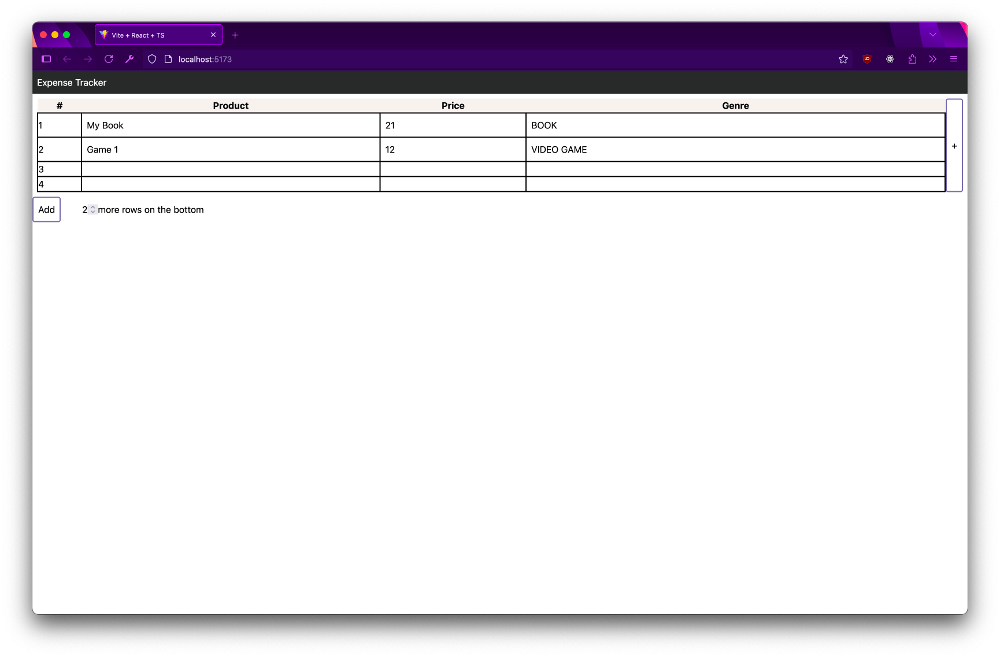

# Project

Just a quick fun project to get familiar with TypeScript and React.
Future implementation is using Java + Spring or Kotlin + Spring.


# Table of Contents

[Core Features](#core-features)

- [Nice-To-Have Features](#nice-to-have-features)

[Technical Improvements](#technical-improvements)

[Roadblocks](#roadblocks)

[Self-Reflection](#improvements--self-reflection)

[Progress Dates](#progress-completion-date)

# Core Features

Frontend Features

- ~~- Add a row~~

- ~~- Edit values inside rows~~

  ~~- Limit the values that can be added in the rows based on the column they are in~~

- ~~Delete rows~~
- ~~- Delete columns~~
- ~~- Add columns~~
- ~~- Allow users to add, remove tags~~
- ~~if delete a tag, any rows that have the tag name should instead now have a blank tag~~
- Save values into local storage
- ~~Convert into CSV file~~
- Login / Sign up

Backend Features:

-

## Nice to have features

- Add a shift-click to select multiple rows
- Fix TableContextMenu tooltip open location
- Add an enter button when editing a column
- Fix the sizing of the columns to be about the same
- Fix the sizing of the columns when editing data value
- Add the ability to delete column

# Technical Improvements

This is listing the technical improvements to be made. Not really any features related to the application

- Move Table into TableContext to avoid prop drilling and stuffing everything into App

# Roadblocks

## Bug 1

- I created a dialog inside a component. I had an issue in figuring how to open the dialog. If it wants to open, it is based on the right-click (or more known as the context menu ) that the first <td> column listens for.

So depending on the contextMenuEvent that <td> is listening for, the dialog opening will open.

Since I am lifting majority of my state inside App, I consider different ways to do so:

1. Just change <TableContextMenu> as a <dialog> instead of storing it as a component
2. Using a useEffect() to listen for change in state value
3. forwardRef

2025/03/14
Bug occurred where deleting a column, will have the next column take on its values.

Debugging steps:

1. Check if I set the filter / map correctly
2. Check if ordering of TableContextMenu --> removeTableRows() or removeTableHeaders() impactted each other
3. Log inside Table if its getting the updated fitlered data
4. review if currValue inside TableData state is impacting
   --> Resolved, since currValue state is holding onto old value, the column data is holding old data. even when passing a prop that is updated.
   HEnce, useEffect() to update the currValue state when new prop data is sent

Error is being caused because realized that the state does not update even if the value prop updates. So must initialize updates using a useEffect

```jsx
function TableData({
  TYPE,
  value,
  colName,
  rowIndex,
  updateTableRows,
  isSelected,
})
  const [currValue, setCurrValue] = useState(value);
  const [isEdit, setIsEdit] = useState(false);

  useEffect(() => {
    setCurrValue(value);
  }, [value]);
```

Another error occurred inside <TableContextMenu> in the following:

```jsx
<button
  onClick={() => {
    removeTableRows();
    removeTableHeaders();
  }}
>
  <span>-</span>
  Delete Rows
</button>
```

Issue is being caused because, inside removeTableRows(), it is setting state of tableRows. Likewise, removeTableHeaders() is doing the same. Hence, these states will override each other. Additionally, after removeTableRows() state finish, removeTableHeaders() goes next but it does not know that removeTableRows() did some manipulation on the table rows. Hence, removeTableHeaders() is working on old outdated information hence it will override the changes made from removeTableRows().

So I needed removeTableHeaders() to wait for removeTableRows() to make its changes first and commit so it can use the updated table rows. Thus I just opted for doing the deleting of rows and columns into one function instead separate.

Fixed code:

```jsx
// combining into one because either removeTableRows() or removeTableHeaders() will override each other setTableRows()
/**
 * after removeTableHeaders() it moves the setState() into the queue
 * so these changes into the rows are not immediately seen inside removeTableRows(),
 * removeTableRows() is still looking at the old state so it will override or somehow make it undefined?
 *
 * Solution, combine both functions into one
 */
const removeRowsHeaders = () => {
  const filterHeaders = tableHeaders.filter((element, index) => {
    if (!selectedHeaders.includes(index)) {
      return element;
    }
  });
  setTableHeader(filterHeaders);

  const filtered = tableRows
    .map((row) => {
      // const tds = row.values; // wrong, it will reference to the original array, so make a copy instead
      const tds = [...row.values];

      tds.map((col, index) => {
        if (selectedHeaders.includes(index)) {
          tds.splice(index, 1);
        }
      });
      console.log("tds", tds);
      return { values: tds };
    })
    .filter((row, index) => {
      if (!selectedRows.includes(index)) {
        return row;
      }
    });

  setTableRows(filtered);
  setSelectedHeaders([]);
  setSelectedRows([]);
  setContextOpen(false);
};
```

Use

```html
<input type="radio" /> or
<select></select>
```

- Use when you have a long list of items

## Bug 2

- Bug when deleting Tag, then the tag columns are now empty. When user tries to change the column tag, it will not trigger the editData() function

Ok, so for a quick fix, I decidede to add an ```<option value ="" disabled>```` which would force the user to select a different tag so now it can trigger the editData()

## Issue 1

As stated in the Improvements / Self-Reflection tab, I am doing a lot of prop-drilling and passing a lot of props to child components. Hence, I am interested in moving all of this passing props into a Context.

# Improvements / Self-Reflection

If you can see, my code is a mess. One mess that stands out to me is prop-drilling. Observe from

```
  <App> -> <Table> -> <TableData> -> <TagForm>
```

I am passing props from App all the way down to its decensdants. In this case, using Context API would have been better.

Secondly, I am passing SO MUCH functions to Table component. That is awful.

The data structure of the rows is terrible.

- Rows are array of objects.
- Inside each object is a property called values.
- Values is an array of objects again.

I may have dones this because I wanted a row data to have an associated column and value
Perhaps I did this because I wanted the ability to move columns around.

# Progress Completion Date

2025/03/13

- Added the following new components:

1. TableContextMenu - created context menu that opens that allow users to delete selected rows

- Added SelectedRows state that allows users to select rows they wish to delete
- removeTableRows() - function that filters rows that are not in the selectedRows so to keep rows that are not targeted to be deleted

2025/03/14

- Added ability to delete column headers
- Fixed bug where the next column takes the values of the previous deleted column. Issue caused by not updating the useState() value hence used a useEffect() to resolve issue.
- Fixed bug where deleting a row is not properly deleted

2025/03/15

- Created TagForm
- Created `<select>` tag with options for user to select a tag for a row

2025/03/16

- Added ability to delete tags ==> WIP to make tag columns blank if deleted a tag that has them
- Added ability to add new tags

2025/03/27

- Updated Tag columns to blank if their Tag was deleted
- Need to fix issue with bug when after deleting a tag, can not update the column with a new value

2025/04/01

- Added the ability to create a CSV file from data

2025/04/08

- Integrated React-Router for different pages
- Created TableContext to encapsulate all things related to table (so it's not stuff into App.tsx and avoid prop drilling)

2025/04/09

- Working on AuthContext to determine if user is logged in
- Preparing MySQL
